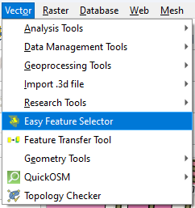

# Easy Feature Selector

Easy Feature Selector plugin for QGIS is a practical tool designed to simplify interactions with vector data. 

It provides a straightforward interface for selecting fields from an attribute table, browsing and searching unique values, and zooming or panning to features directly on the map. 

The plugin also displays detailed attribute information, including a clear indication of whether a feature has geometry, and includes a convenient feature for copying all table data to the clipboard for easy export or analysis.

**Note:** Even though you can select multiple features with the same unique field value, this tool was developed with the intent of working with one feature at a time.

The extension is available from the official repository, [QGIS plugins page](https://plugins.qgis.org/plugins/easyfeatureselection/). 

Use the QGIS Plugins menu to install the Easy Feature Selector, [QGIS manual](https://docs.qgis.org/3.34/en/docs/user_manual/plugins/plugins.html).

Easy Feature Selector is under development and test with QGIS 3.34.

## Functionality

- Allows users to select fields (columns) from the attribute table of an active vector layer.
- Displays and highlights unique values for the selected field, enabling quick navigation and selection with interactive zooming and panning options to automatically focus on selected features.
- Allows users to filter unique values to locate them quickly.
- Allows users to control over zoom level when selecting a feature through an adjustable slider.
- Enables two-way selection, where selecting a feature on the map highlights the corresponding value in the list and vice versa.
- Displays a table of attribute data for the selected feature, including an indicator for whether a feature has valid geometry.
- Highlights features without geometry in yellow and prevents zooming/panning to them.
- Allows users to copy all attribute data to the clipboard for easy export.

## Interface

  

## Using the Easy Feature Selector

1. Layer Selection
  
  The first section you will see in the dialog is called Layer Selection. It contains a dropdown menu listing all the vector layers. If it is not a vector layer, an error will display "This Plugin Supports Only Vectors". Simply click on the dropdown and choose the layer you are interested in. This selection will automatically update the list of all fields from the active vector layer in the next section.
  

  **Component:**

  - **Dynamic Layer Selection:** Enable this option to make your selection work both ways. If you select a layer in the Layers Panel, it will automatically change the layer in the Layer Selection, and vice versa.

2. Field Selection
  
  The next section that you will see in the dialog is called Field Selection. It contains a dropdown menu listing all the fields (or columns) from the active vector layer’s attribute table. Simply click on the dropdown and choose the field you are interested in. This selection will automatically update the list of unique values in the next section.

  

3. Unique Values
  
  Once you have selected a field, this section will show all the unique values from that field. For example, if you choose a field called 'City,' this list will display all the unique city names in your data. You can click on a value with your mouse or use the arrow keys on your keyboard to navigate and select. The selected value will highlight all matching features on the map. You can easily scroll through and select values using your keyboard for a more efficient workflow.

  

4. Search and Zoom Options
  
  This section gives you more control over how you interact with the features on the map.
  

  **Components:**

  - **Search Box:** If you have a long list of unique values, type in this box to filter and quickly find what you’re looking for.
  - **Interactive Zooming and Panning:** Check this box if you want the map to automatically zoom and pan to the selected feature.
  - **Zoom Level Slider:** Adjust this slider to control how much the map zooms in when a feature is selected. Slide left for less zoom and right for more zoom.
  - **Two-Way Selection:** Enable this option to make your selection work both ways. If you select a feature on the map, it will automatically highlight the corresponding value in the list, and vice versa.

  

5. Feature Attributes Table
  
  This table shows you all the attribute data for the feature you have selected. It includes the names of the fields and their corresponding values.
  

  **Component:**

  - **2nd Selection:** Enable this option to display a column named "Additional Selection" to choose a value for the corresponding field. If you select a feature attribute with multiple values, a list of values will be displayed in the dropdown for that field.
  

  **Special Row - Geometry_Type:**

  - **Purpose:** At the very top of the table, there is a special row called 'Geometry_Type.' It tells you if the selected feature has geometry or not.  This means that if the feature has a valid geometry  (i.e: like a point, line, or polygon), it will say 'Has a Geometry'. If the feature doesn’t have a shape, it will say 'Has No Geometry,' and the cell will be highlighted in yellow. This way, you will know that zooming to this feature won’t work.

  

6. Copy Table Data to Clipboard
    
  There is a button labeled 'Copy Table Data to Clipboard' right below the table. When clicking this button to copy everything from the table to your clipboard. You can then paste it into a spreadsheet, text document, or anywhere else you want to use the data.

  

7. Close Button
    
  Click this button when you are done using the Easy Feature Selector to close the dialog.

## New Features

1. Layer Management
   

- **New Layer Selection Group Box**: Dedicated section for layer management
- **Dynamic Layer Selection**: New option to allow dynamic layer selection while working
- **Layer Combo Box**: QGIS-native layer selection widget (QgsMapLayerComboBox)
- **Improved Raster Warning**: Clear visual warning when raster layers are selected

  

2. UI Improvements
   

  **Split Panel Design**:

  - Adjustable left/right panels with splitter
  - Minimum width constraints for better usability
  - Resizable panels for custom workspace

  

3. Feature Attributes
   

  **Enhanced Table Features**:
  - New "Additional Selection" column option
  - Second level selection capability
  - Copy to clipboard functionality
  - Improved table styling and header design

  

4. Search and Selection
   

  **Advanced Selection Features**:
  - Radio button selection in attribute table
  - Combo box selection for field values
  - Value cell updates with combo box options

  

5. Technical Enhancements
   

  **Signal Management**:
  - Improved signal connection/disconnection handling
  - Better error handling for layer changes
  - Enhanced feature selection management

  

6. Memory Management
   

  **Optimized Resource Usage**:
  - Better widget cleanup on layer changes
  - Improved memory handling for large datasets
  - More efficient table updates

  

7. Visual Feedback
    

  **Enhanced User Experience**:
  - Modern styling for all components
  - Better visual hierarchy
  - Improved state indicators

## Tutorial 

Guide for **Easy Feature Selector** is available here: [Easy Feature Selector](https://gis.com.my/training/qgis-plugin/easy-feature-selector/).

## Installation

Go to *Plugins > Manage and Install Plugins.. > All*.

Search for **Easy Feature Selector**.

OR

Download the zip file in [Github](https://github.com/gisinnovationmy/EasyFeatureSelector).

Go to *Plugins > Manage and Install Plugins.. > Install from ZIP*.

After installation, the plugin will appear under *Vector* menu.

  

## License

This plugin is distributed under GNU GPL v.2 or any later version.

## Support

We've just begun and have implemented basic functionality so far. Our goal is to expand the range of services and introduce new features.

We appreciate any feedback, and pull requests are welcome on **GitHub**.

To get started, refer to the user guide, or you can ask questions and share comments in the discussion section.